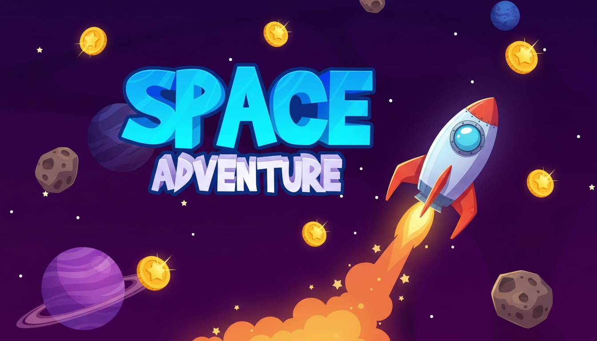

# 🚀Space Adventure🚀

👨🏼‍🚀Steer your shuttle, dodge monsters, collect coins, and reach the sun! A free children’s game built with Python + Pygame.☄️

## How to Play 🎮

- Use arrow keys to move the shuttle.
- Avoid monsters; they wander then chase.
- Collect coins for points and reach the bright sun to win.
- You have three lives; difficulty ramps up over time.

## Running the Game

### Run Locally

1. Install Python 3.10+ and Pygame:
   ```
   pip install pygame
   ```
2. Run the game:
   ```
   python space_adventure.py
   ```
3. Enter your name and age in the game window, then play with the arrow keys.

### Build an EXE

1. Install PyInstaller:
   ```
   pip install pyinstaller
   ```
2. From the game folder, build:
   ```
   pyinstaller --noconsole --onefile --name SpaceAdventure --add-data "assets;assets" space_adventure.py
   ```
3. Find the executable at `game/dist/SpaceAdventure.exe`.

## Game View 🧩




---

Made with Python + Pygame.
